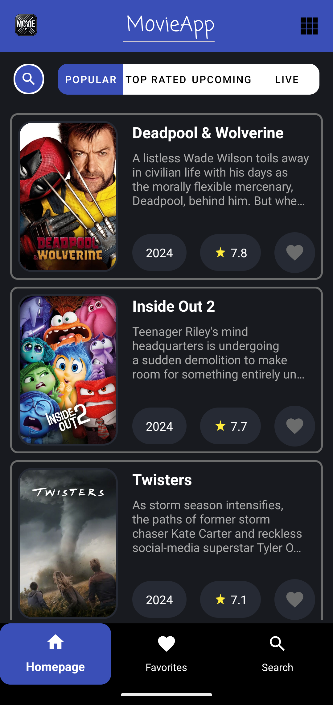
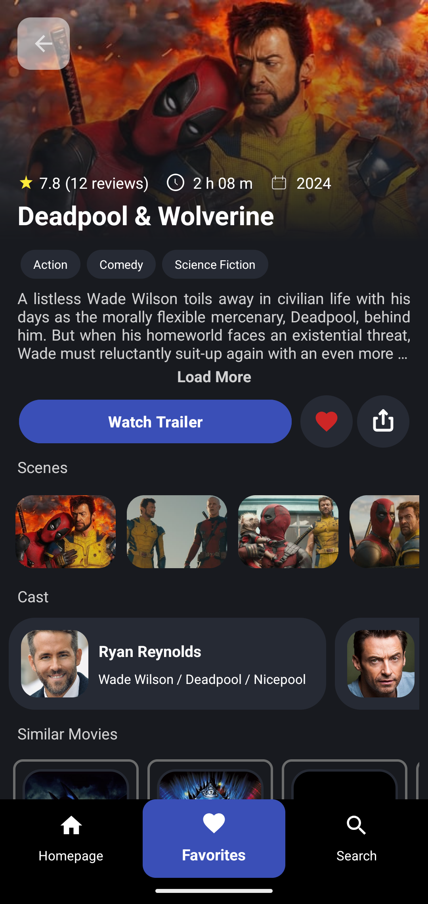
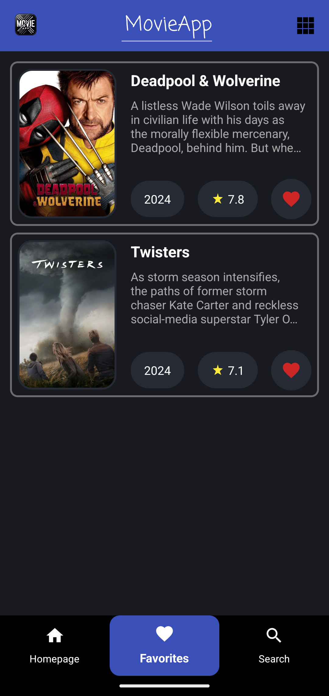

# MovieApp 🎬

**MovieApp**, Android platformunda Kotlin dili kullanılarak geliştirilmiş bir mobil uygulamadır. Bu uygulama, kullanıcılara popüler, en çok oy alan, vizyondaki ve yakında çıkacak filmler hakkında bilgi sunar. Kullanıcılar film arayabilir, film detaylarını görüntüleyebilir ve favori listelerine ekleyebilirler.

## Özellikler 📱

- **Film Arama**: Kullanıcılar anahtar kelimelerle film arayabilir.
- **Popüler Filmler**: Güncel popüler filmleri listeler.
- **En Çok Oy Alan Filmler**: En yüksek oylamaya sahip filmleri gösterir.
- **Vizyondaki Filmler**: Halen vizyonda olan filmleri listeler.
- **Yakında Çıkacak Filmler**: Yakında çıkacak olan filmleri gösterir.
- **Film Detayları**: Her film için ayrıntılı bilgi ve fragman izleme seçeneği sunar.
- **Favorilere Ekleme**: Kullanıcılar favori filmlerini kaydedebilir.

## Ekran Görüntüleri 📸

<div style="display: flex; flex-direction: row; justify-content: space-around;">
    
    
    
</div>

## Kurulum ve Kullanım 🛠️

### Gereksinimler

- Android Studio Arctic Fox veya daha yeni bir sürüm
- Minimum API seviyesi: 24 (Android 7.0 Nougat)

### Kurulum

1. Bu depoyu klonlayın:
    ```bash
    git clone https://github.com/berkkanrencber/MovieApp.git
    ```
2. Android Studio'yu açın ve proje klasörünü içe aktarın.
3. Gerekli bağımlılıkların yüklü olduğundan emin olmak için projeyi senkronize edin.
4. Bir Android cihaz veya emülatör bağlayın ve uygulamayı çalıştırın.

## Kullanılan Teknolojiler ve Kütüphaneler 🛠️

- **Kotlin**: Uygulamanın yazılım dili.
- **XML ve ViewBinding**: UI tasarımı ve yönetimi için XML tabanlı layout'lar ve ViewBinding kullanımı.
- **MVVM Mimarisi**: Uygulama mimarisi olarak Model-View-ViewModel yapısı.
- **Coroutines**: Asenkron işlemler ve arka plan görevleri için Kotlin Coroutines.
- **Dagger-Hilt**: Dependency Injection (Bağımlılık Enjeksiyonu) için.
- **Retrofit**: REST API çağrıları için.
- **Room**: Yerel veritabanı yönetimi için.
- **Coil**: Görüntü yüklemek için.
- **Navigation Component**: Uygulama içi gezinme için.

## API Anahtarı Ekleme 🔑

Uygulamanın çalışabilmesi için bir film API anahtarına ihtiyacınız var. Lütfen şu adımları izleyin:

1. [The Movie Database (TMDb)](https://www.themoviedb.org/) web sitesinden bir API anahtarı alın.
2. `local.properties` dosyasına `API_KEY=YOUR_API_KEY` şeklinde ekleyin.

## İletişim 📧

- **Geliştirici**: [berkkanrencber](https://github.com/berkkanrencber)
- **E-posta**: berkkanrencber@gmail.com

Her türlü geri bildiriminizi ve önerinizi duymaktan memnuniyet duyarım! 🎉
